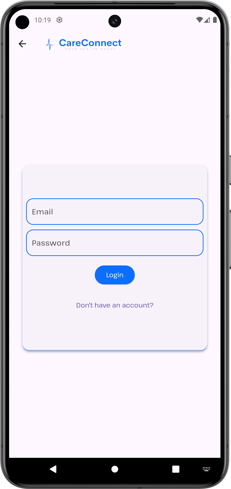
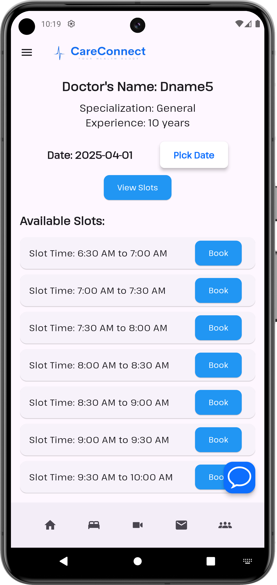

# CareConnect 

## 📌 About the Project
**CareConnect** is a mobile application developed using **Flutter** that helps users book hospital beds and check availability in real time. The app is part of a larger ecosystem, including a **React-based web frontend** and a **Django backend**.

CareConnect provides a **seamless healthcare management experience**, allowing users to not only find and book hospital beds but also schedule **appointments with doctors**. The app integrates a **video consultation feature**, enabling remote medical assistance. Users can search for healthcare providers, check doctor availability, and consult them via **secure video calls**, ensuring accessibility even in emergencies.

The platform is designed to bridge the gap between hospitals and patients by **digitizing the entire booking and consultation process**, making healthcare more efficient and accessible. With real-time updates and a user-friendly interface, CareConnect aims to revolutionize the way people access medical services.

## 🚀 Features
- 🏥 **Real-time Hospital Bed Availability**
- 📅 **Appointment Booking System**
- 📹 **Video Consultation with Doctors**
- 🔎 **Doctor Listings & Specializations**
- 🔐 **Secure User Authentication** (Firebase Auth)
- 📍 **Hospital & Doctor Location Mapping**
- 📊 **Dashboard for Healthcare Insights**

## 🛠️ Tech Stack
### **Frontend:**
- **Flutter** (Mobile App)
- **React.js** (Web Dashboard)

### **Backend:**
- **Django** (REST API)
- **MySQL** (Database)

## 📲 Installation & Setup
### **Prerequisites**
- Install **Flutter**: [Official Installation Guide](https://flutter.dev/docs/get-started/install)
- Install **Dart SDK**
- Clone the repository:
  ```sh
  git clone https://github.com/AryanChachra/CareConnect.git
  ```
- Navigate to the project directory:
  ```sh
  cd CareConnect
  ```
- Install dependencies:
  ```sh
  flutter pub get
  ```
- Run the app:
  ```sh
  flutter run
  ```

## 📸 Screenshots








## 🎯 Contributors
- **Aryan Chachra** - Flutter Developer
- **Gaurav Kadaskar** - Backend Developer
- **Kunal Bamoriya** - Frontend Developer  

